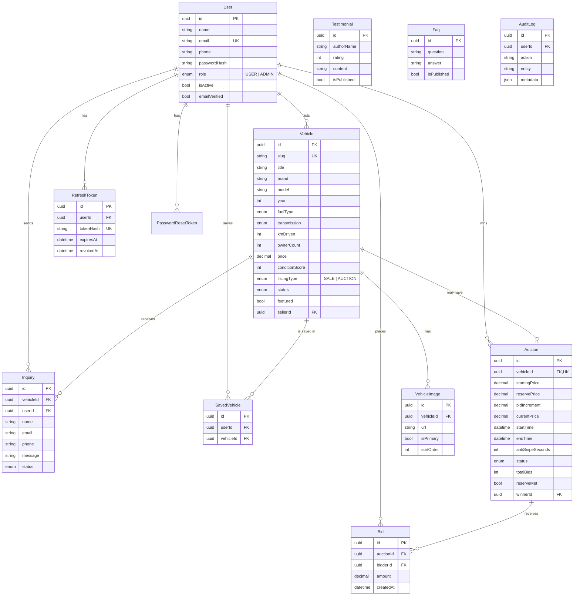

# Architecture & Design

This document explains the system design, data model, folder layout, real-time bidding
engine, and the production concerns (security, observability, scaling) behind Vutto Auctions.

---

## 1. System overview

```
                         ┌───────────────────────────────────────────┐
                         │                Browser (SPA)               │
                         │  React + Vite + Tailwind + React Query      │
                         │  ─ Axios (REST)   ─ Socket.IO client (WS)   │
                         └───────┬───────────────────────┬─────────────┘
                       HTTPS/REST│                        │WebSocket (bidding)
                                 ▼                        ▼
                         ┌───────────────────────────────────────────┐
                         │            Node.js API (Express)            │
                         │                                             │
                         │  Middleware: Helmet · CORS · rate-limit ·   │
                         │  validation (Zod) · auth (JWT) · logging ·  │
                         │  metrics                                    │
                         │                                             │
                         │  Modules (auth, users, vehicles, auctions,  │
                         │  inquiries, cms, admin)                     │
                         │                                             │
                         │  Realtime: Socket.IO rooms + bid handler    │
                         │  Scheduler: auction lifecycle ticker        │
                         └───────┬─────────────────────────────────────┘
                                 │ Prisma ORM (typed, parameterised SQL)
                                 ▼
                         ┌───────────────────────────────────────────┐
                         │            PostgreSQL (Neon)                │
                         └───────────────────────────────────────────┘
```

**Why this shape**

- **REST for everything except bidding.** CRUD, search and auth are request/response —
  REST + React Query (caching, retries, pagination) is the right tool. Only the auction
  bid stream needs push semantics, so only that uses WebSockets.
- **One source of truth for bids.** The same `placeBid` service is invoked by both the
  WebSocket handler and a REST fallback, so business rules can never diverge by transport.
- **Stateless API + stateful DB.** The API holds no per-user session state (JWTs are
  self-contained), which makes horizontal scaling straightforward (see §8).

---

## 2. Request lifecycle

1. **CORS + Helmet** — only the known frontend origin is allowed; hardened headers are set.
2. **Body parsing & HPP** — JSON parsed (1 MB cap), duplicate query params stripped.
3. **Request context** — a correlation id (`x-request-id`) is attached and an access-log
   line is emitted; the id is echoed in the response for end-to-end tracing.
4. **Rate limiting** — a global limiter on `/api`, plus a stricter one on auth routes.
5. **Validation** — the route's Zod schema parses `body`/`query`/`params`; invalid input is
   rejected with a `422` and per-field messages before any controller runs.
6. **Auth + RBAC** — `authenticate` verifies the JWT and sets `req.user`; `authorize('ADMIN')`
   gates admin routes.
7. **Controller → Service → Prisma** — thin controllers delegate to services that own the
   business logic and database access.
8. **Response envelope** — success is always `{ success: true, data, meta? }`; errors are
   always `{ success: false, error: { code, message, details? } }`.

---

## 3. Data model (ER diagram)



> The canonical schema is [`backend/prisma/schema.prisma`](../backend/prisma/schema.prisma).
> `SiteContent` (editable homepage blocks) and `PasswordResetToken` are also part of the
> model but omitted from the diagram for clarity.

---

## 4. Schema explanation (tables, fields, constraints, relationships)

### `users`
| Field | Type | Constraints | Notes |
| --- | --- | --- | --- |
| `id` | UUID | PK | |
| `name` | string | required | |
| `email` | string | **unique**, required | login identifier; stored lowercased |
| `phone` | string | nullable | |
| `passwordHash` | string | required | bcrypt hash, never the raw password |
| `role` | enum `USER\|ADMIN` | default `USER`, indexed | drives RBAC |
| `isActive` | bool | default `true` | deactivated users can't log in |
| `emailVerified` | bool | default `false` | |

Relationships: 1‑to‑many to `Vehicle` (as seller), `Bid`, `Inquiry`, `SavedVehicle`,
`RefreshToken`, `PasswordResetToken`; 1‑to‑many to `Auction` as the (current/final) winner.

### `vehicles`
The catalogue entity. Money (`price`) is `Decimal(12,2)` — never floats — to avoid rounding
errors. `slug` is unique and human/SEO friendly. Indexed on the columns users filter and
sort by: `status`, `listingType`, `brand`, `fuelType`, `year`, `price`, `featured`, `city`.
`status` (`DRAFT/PENDING/ACTIVE/SOLD/REJECTED/ARCHIVED`) gates public visibility — only
`ACTIVE` rows appear in public queries. `onDelete: Cascade` from the seller removes their
listings.

### `vehicle_images`
Ordered images per vehicle (`sortOrder`, `isPrimary`). Cascade-deleted with the vehicle.

### `auctions`
One-to-one with a vehicle (`vehicleId` is **unique**). Holds the money rails
(`startingPrice`, optional hidden `reservePrice`, `bidIncrement`, live `currentPrice`),
the window (`startTime`/`endTime`), `antiSnipeSeconds`, denormalised `totalBids` and
`reserveMet` for cheap reads, and `winnerId` (the current leader while live, the confirmed
winner once settled). Indexed on `status`, `endTime`, `startTime` for the scheduler.

### `bids`
Append-only ledger of every accepted bid. Composite index `(auctionId, createdAt)` powers
fast "latest bids" reads; `bidderId` index powers "my bids".

### `inquiries`
Buyer→seller leads. `userId` is nullable so **guests** can inquire; `onDelete: SetNull`
preserves the lead if the user is later deleted. `status` = `NEW/CONTACTED/CLOSED`.

### `saved_vehicles`
Join table for the wishlist with a **unique** `(userId, vehicleId)` so a bike can be saved
only once per user.

### `refresh_tokens` & `password_reset_tokens`
Only the **SHA‑256 hash** of each token is stored, with `expiresAt` and (for refresh)
`revokedAt`. A DB leak therefore never exposes a usable token. See §6 for rotation/reuse.

### `testimonials`, `faqs`, `site_content`
CMS content with `isPublished`/`sortOrder`; `site_content` is a generic key→JSON store for
editable homepage blocks (e.g. the hero).

### `audit_logs`
Security/operations trail (`action`, `entity`, `entityId`, `metadata`, `ip`) for events like
logins, bids and admin actions. Indexed on `userId`, `action`, `createdAt`.

---

## 5. Folder structure

### Backend (`backend/src`)

| Path | Purpose |
| --- | --- |
| `config/` | Validated env (`env.ts`), Prisma singleton (`prisma.ts`), structured logger (`logger.ts`). Boot fails fast on bad config. |
| `middleware/` | Cross-cutting Express middleware: `auth` (JWT + RBAC), `validate` (Zod), `error` (central handler), `rateLimit`, `requestContext` (correlation id + logs), `metrics`, `notFound`. |
| `modules/<domain>/` | **Feature-first** slices. Each has `*.routes.ts` (HTTP surface), `*.controller.ts` (thin HTTP glue), `*.service.ts` (business logic + DB), `*.validation.ts` (Zod schemas). Domains: `auth`, `users`, `vehicles`, `auctions`, `inquiries`, `cms`, `admin`. |
| `realtime/` | `socket.ts` (Socket.IO server + auth + bid handler), `io.ts` (shared instance + room helpers), `auctionEvents.ts` (broadcast helpers shared by REST + WS), `scheduler.ts` (lifecycle ticker). |
| `routes/` | Mounts every module router under `/api`. |
| `services/` | App-level services not tied to one domain (e.g. `email.service.ts`). |
| `utils/` | Pure helpers: `ApiError`, `asyncHandler`, `jwt`, `password`, `pagination`, `slug`, `response`, `audit`. |
| `types/` | Ambient type augmentation (e.g. `Express.Request.user`). |
| `app.ts` / `server.ts` | `app.ts` builds the Express app (testable in isolation); `server.ts` boots HTTP + sockets + scheduler with graceful shutdown. |
| `prisma/` | `schema.prisma` and `seed.ts`. |
| `tests/` | `unit/` (pure logic) and `integration/` (supertest against a test DB). |

**Why feature-first over layer-first?** Everything about "auctions" lives in one folder, so a
change touches one place and the module boundary is obvious. Within a module we still keep
the route → controller → service → validation layering for testability and separation of
concerns.

### Frontend (`frontend/src`)

| Path | Purpose |
| --- | --- |
| `components/ui/` | Design-system primitives: `Button`, `Field` (Input/Select/Textarea), `Modal`, `Pagination`, `Toast`, `Spinner`, `Misc` (badges, empty states, skeletons). |
| `components/layout/` | Shells & guards: `Navbar`, `Footer`, `PublicLayout`, `DashboardLayout`, `AdminLayout`, `AuthLayout`, `ProtectedRoute`, `AppBootstrap`. |
| `components/home/` | Landing-page sections (`Hero`, `Sections`). |
| `components/vehicles/` | `VehicleCard`, `FilterPanel`. |
| `components/auctions/` | `AuctionCard`, `Countdown`. |
| `pages/` | Route components (public, `auth/`, `dashboard/`, `admin/`). |
| `services/` | Typed API wrappers (one file per domain) over Axios. |
| `hooks/` | `useAuctionSocket` (live bidding), `useCountdown`, `useSaved`. |
| `store/` | Zustand `auth` store (session bootstrap, login/register/logout). |
| `lib/` | `api` (Axios + token refresh interceptor), `socket`, `queryClient`, `format` (₹/date helpers). |
| `types/` | Shared DTO types mirroring the API. |
| `routes/` | The `createBrowserRouter` route tree. |

---

## 6. Authentication & security

**Token strategy (defence-in-depth):**

- **Access token** — short-lived JWT (15 min), kept **in memory** on the client. Not in
  `localStorage`, so XSS can't trivially exfiltrate it.
- **Refresh token** — long-lived (7 days), random opaque string delivered in an **httpOnly,
  Secure, SameSite cookie** scoped to `/api/auth`. Only its SHA‑256 hash is stored.
- **Rotation + reuse detection** — every refresh issues a new token and revokes the old one.
  If a already-revoked token is replayed (theft signal), **all** of that user's tokens are
  revoked. Password change/reset also revokes all sessions.

**Other controls (each maps to a real risk):**

| Control | Risk mitigated |
| --- | --- |
| **bcrypt** (cost 12) | Offline cracking of a leaked password DB |
| **Helmet** | Clickjacking, MIME sniffing, missing HSTS, etc. |
| **CORS allow-list + credentials** | Cross-origin abuse while still allowing the cookie |
| **Rate limiting** (stricter on auth) | Brute-force / credential stuffing / abuse |
| **Zod validation** | Malformed/oversized input reaching business logic |
| **Prisma (parameterised queries)** | SQL injection |
| **httpOnly tokens + React escaping** | XSS token theft |
| **RBAC (`authorize`)** | Privilege escalation to admin actions |
| **Generic auth errors + no user enumeration** | Account discovery |
| **Audit log** | Forensics / abuse investigation |

> **CSRF:** the refresh cookie is only accepted on `POST /api/auth/refresh` and the access
> token is sent as a `Bearer` header (not a cookie), so state-changing API calls are not
> cookie-authenticated and are not CSRF-able. `SameSite` adds a second layer.

---

## 7. Real-time bidding engine

**Connecting & joining.** The client opens an authenticated Socket.IO connection (JWT in the
handshake) and emits `auction:join <auctionId>` to enter that auction's room.

**Placing a bid** (`bid:place`) runs the server-authoritative `placeBid` service:

```
BEGIN;
  SELECT id FROM auctions WHERE id = $1 FOR UPDATE;   -- row lock: serialises concurrent bids
  -- validate: status = LIVE, now within [start,end], bidder ≠ seller,
  --           amount ≥ minimum next bid (start price, or current + increment)
  INSERT INTO bids (...);
  -- anti-snipe: if < antiSnipeSeconds remain, push endTime out
  UPDATE auctions SET currentPrice, totalBids+1, winnerId=bidder, reserveMet, endTime;
COMMIT;
```

The `SELECT … FOR UPDATE` guarantees that two simultaneous bids at the same price can't both
win — Postgres serialises them on the row lock, so exactly one succeeds and the other is
re-validated against the new price. The accepted bid is then broadcast to the room as
`bid:new` (new price, bid count, possibly extended end time). The bidder gets an ack
(`{ ok, currentPrice }`) or a `bid:rejected` with a reason.

**Anti-sniping.** A bid in the final `antiSnipeSeconds` extends `endTime`, so the auction
can't be "sniped" in the last second — everyone gets a fair chance to respond.

**Lifecycle scheduler.** An in-process ticker (`scheduler.ts`, every `AUCTION_TICK_MS`):

1. promotes due `SCHEDULED` auctions → `LIVE` (emits `auction:status LIVE`);
2. ends expired `LIVE` auctions → settles them (`settleAuction`): the highest bid wins **iff**
   it meets the reserve; the vehicle is marked `SOLD` or `ARCHIVED`; emits `auction:status SETTLED`;
3. updates the `auctions_live_total` gauge.

---

## 8. Scalability

- **Stateless API** — JWT auth means any instance can serve any request, so the API scales
  horizontally behind a load balancer.
- **WebSocket fan-out across instances** — Socket.IO rooms are per-instance. To run multiple
  API instances, add the **Redis adapter** (`@socket.io/redis-adapter`) so `bid:new` reaches
  clients connected to other nodes. (Single instance needs nothing.)
- **Single lifecycle owner** — the scheduler must run once globally. With multiple instances,
  elect a leader via a **Postgres advisory lock** or run the scheduler as a dedicated worker
  process. The bidding path is already safe regardless, thanks to the row lock.
- **Database** — Neon's pooled connection string handles serverless connection limits;
  Prisma uses a single pool per instance. Hot read paths (listings, auctions) are covered by
  the indexes in §4; add read replicas if read volume grows.
- **Client** — React Query caches and dedupes requests; the bundle can be route-split if it
  grows (the build currently emits a single ~160 kB gzipped chunk).

---

## 9. Observability

- **Structured logs** — pino emits JSON in production (ready for Loki/Datadog/CloudWatch),
  pretty logs in dev; secrets are redacted; every request carries a correlation id.
- **Metrics** — `GET /metrics` exposes Prometheus data: HTTP latency histogram by
  route/method/status, `auctions_live_total`, `bids_placed_total`, and default Node metrics.
- **Health** — `GET /health` for load-balancer probes.
- **Audit trail** — security-relevant actions persisted to `audit_logs`.

---

## 10. Testing strategy

- **Unit** (no DB): bid-increment rules, JWT/TTL helpers, slug generation, pagination math —
  fast and deterministic, the core money/auth logic.
- **Integration** (supertest + Postgres, opt-in via `RUN_DB_TESTS=1`): the real
  register → duplicate → login → `/me` → unauthorised flow through the actual Express app.

This pyramid keeps the default suite instant while still allowing full HTTP coverage in CI
where a database is available.
